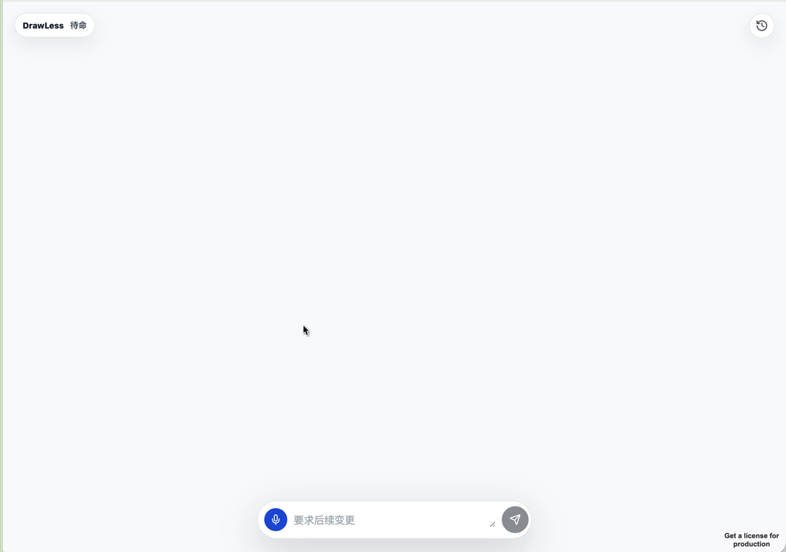

# AI 语音绘图工具

> 用语音完成绘图创作：说出想法，系统理解指令并在画布上一笔一画画出来。

**七牛云暑期实训营参赛作品** | 选题：题目二：AI 语音绘图工具

---

## 作品简介

本项目是一款纯语音控制的绘图工具。用户可以通过语音说出“画一个火箭”“先画一棵树，清除画布后，画一个火箭”“画树状图”等指令，系统会完成语音识别、意图解析、绘图执行和过程动画。

当前版本以 **MiMo ASR 句子模式** 作为主要语音入口，结合本地规则、AI Parser、视觉资产库和 tldraw 画布，重点解决三件事：

- 不依赖鼠标键盘完成绘图操作
- 尽量理解自然语言里的复合指令
- 让图形不是瞬间出现，而是按笔画逐步绘制

## 演示视频

[](docs/demo/demo.mov)

点击上方封面可查看录屏演示。GitHub README 对 `.mov` 的内联播放支持不稳定，因此这里采用封面图 + 视频文件链接的方式提交到仓库。

---

## 当前进度

### Day 1（6月12日）— 核心链路打通

- React + Vite 前端应用搭建
- Express API 服务搭建
- Web Speech API 基础语音识别
- 基础绘图指令：圆形、矩形、文字、移动、改色、撤销、重做、清空
- 设计文档初版，梳理支持能力与未完成能力

### Day 2（6月13日）— 语音识别与复杂指令

- 接入 MiMo `mimo-v2.5-asr`，作为跨浏览器语音识别主路径
- 接入 AI Parser，把自然语言转成受控 `DrawOperation[]`
- 支持多步指令，例如“清空画布，然后画一个火箭”
- 接入 tldraw 画布展示
- 引入视觉资产库，支持大象、猫、树、树状图、房子、汽车、火箭等对象
- 同步 Excalidraw 公共素材库，支持部分外部素材检索

### Day 3（6月14日）— 绘制体验打磨

- 修复“树状图”误识别成“树”的问题
- 修复“清除画布后”没有真正清除的问题
- 多步指令按 timeline 播放：先画树，再清空，再画火箭
- 图形改为一笔一画绘制，普通形状、视觉资产、外部素材都有 stroke 动画
- 修复点击 `Bolna MiMo` 时已有图形闪烁/重绘的问题
- OpenAI Realtime / Gemini Live 做过探针，因 key 配额和项目权限问题暂列待完成

---

## 功能特性

| 功能 | 说明 | 状态 |
|---|---|---|
| MiMo 语音识别 | 录音后调用 `mimo-v2.5-asr` 转写中文指令 | 已实现 |
| 本地指令解析 | 常见绘图、移动、改色、清空、撤销、重做 | 已实现 |
| AI Parser | 复杂自然语言转绘图操作 | 已实现第一版 |
| 多步指令 | 支持“先画...清除画布后...”这类顺序执行 | 已实现 |
| 一笔一画动画 | path 按 delay 顺序绘制，填色延后出现 | 已实现 |
| 视觉资产绘制 | 火箭、大象、树、汽车等对象不再用简单形状硬拼 | 已实现 |
| tldraw 画布 | 主界面嵌入 tldraw，保留 SVG 镜像作为回归基线 | 已实现第一阶段 |
| 公共素材检索 | 基于 Excalidraw Libraries 的素材懒加载 | 已实现竖切 |
| Web Speech 实时草稿 | Chrome/Edge 下可用 interim transcript 做草稿预览 | 已实现 |
| OpenAI Realtime | 官方 key 配额不足，暂不作为主路径 | 待完成 |
| Gemini Live | Google 项目无 Live API 权限，暂不开放入口 | 待完成 |

---

## 技术栈

| 层次 | 技术 | 说明 |
|---|---|---|
| 前端 | React 19 + Vite | 单页面应用 |
| 画布 | tldraw + SVG mirror | tldraw 展示，SVG 负责稳定回归和导出 |
| 手绘效果 | roughjs + CSS stroke animation | 草图风格与一笔一画动画 |
| 语音识别 | MiMo ASR / Web Speech API | MiMo 为当前主路径，Web Speech 做浏览器实时草稿 |
| AI 解析 | MiMo-compatible chat API | 将复杂自然语言解析为绘图操作 |
| 后端 | Express + TypeScript | API 代理、ASR、AI Parser、Realtime 探针 |
| 测试 | Vitest + Testing Library | 单元测试和前端行为回归 |

---

## 快速开始

### 环境要求

- Node.js >= 20
- MiMo API Key

### 安装依赖

```bash
npm install
```

### 配置环境变量

复制 `.env.example` 为 `.env`，按需填写：

```bash
BOLNA_MIMO_API_URL=https://api.xiaomimimo.com/v1/chat/completions
BOLNA_MIMO_API_KEY=your_mimo_key
AI_PARSER_API_URL=https://api.xiaomimimo.com/v1/chat/completions
AI_PARSER_API_KEY=your_mimo_key
AI_PARSER_MODEL=mimo-v2.5-pro
```

### 本地运行

```bash
# API 服务，默认 8790
npm run dev:api

# 前端服务，默认 5173
npm run dev -- --host 127.0.0.1
```

打开：

```text
http://127.0.0.1:5173
```

### 测试与构建

```bash
npm test -- --run
npm run build
```

---

## 推荐演示指令

录制或现场演示时，建议用空格键开始/结束录音，按下面顺序展示：

1. “画一个太阳和几朵云”
2. “画一棵树”
3. “在树的旁边画一辆小汽车”
4. “把汽车向右移动一点”

这组命令可以展示语音识别、自然语言绘图、多对象添加和继续修改能力。

---

## 核心设计亮点

### 1. 混合解析策略

常见命令走本地规则，响应快；复杂命令走 AI Parser，表达力更强。这样能兼顾速度和自然语言理解能力。

```text
语音输入 → ASR 转写 → 本地规则判断 → 必要时 AI Parser → DrawOperation[] → 画布执行
```

### 2. 多步指令 timeline

系统不再只计算最终状态，而是保留每一步中间状态。例如：

```text
先画一棵树 → 清除画布 → 画一个火箭
```

画布会按顺序演示过程，而不是直接跳到最终火箭。

### 3. 一笔一画绘制

图形完整挂载后，每条 SVG path 通过 `--draw-delay` 和 `--draw-duration` 顺序绘制。填充色在线条接近完成后出现，观感更接近手绘。

### 4. 视觉资产优先

火箭、大象、树、汽车等对象优先使用本地视觉资产或公共素材，不再让 AI 临时用圆形、矩形硬拼。

---

## 项目结构

```text
/
├── docs/                         # 设计文档
├── public/vendor/                # Excalidraw 公共素材
├── scripts/                      # 素材同步脚本
├── src/
│   ├── server/                   # Express API
│   ├── voice-drawing/            # 语音绘图核心逻辑
│   │   ├── parser.ts             # 本地指令解析
│   │   ├── executor.ts           # 绘图操作执行器
│   │   ├── drawingAnimation.ts   # timeline 动画
│   │   ├── roughSvgRenderer.ts   # 手绘 SVG 渲染
│   │   └── visualAssets.ts       # 本地视觉资产
│   ├── App.tsx                   # 主界面
│   └── styles.css                # UI 与绘制动画样式
└── README.md
```

---

## 当前限制

- MiMo 当前为一句一句录音识别，不是真正 WebRTC 级实时流式语音。
- Web Speech 的实时草稿依赖浏览器兼容性。
- AI Parser 复杂场景仍受延迟和绘图协议表达能力限制。
- tldraw Editor API 还未完全接管历史、导出和对象编辑。

---

## 依赖声明

| 依赖 | 用途 | 许可 |
|---|---|---|
| React | 前端 UI | MIT |
| Vite | 构建工具 | MIT |
| Express | 后端 API | MIT |
| tldraw | 画布能力 | Apache-2.0 |
| roughjs | 手绘风格渲染 | MIT |
| lucide-react | 图标 | ISC |
| Vitest | 测试 | MIT |
| Excalidraw Libraries | 公共素材库 | MIT |

---

## 设计文档

- [设计文档](docs/design.md)

---

## 许可

本项目为七牛云暑期实训营参赛作品。仅用于学习、竞赛和作品展示。
